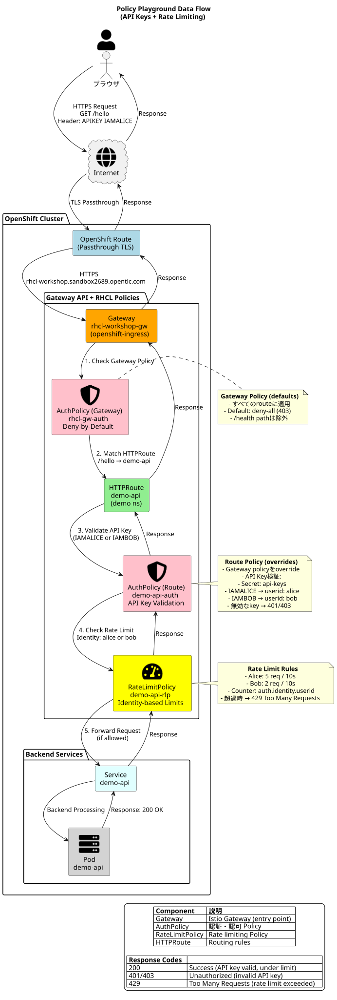

# Red Hat Connectivity Link (RHCL) デモワークショップ — GitOps対応

このリポジトリは、**OpenShift 4.20** 上で **Red Hat Connectivity Link (Kuadrant)** が **Gateway API** トラフィックにPolicyを適用する方法を示す、**ライブデモ対応**のワークショップです。

目的はシンプルです：1つのUI、いくつかのモジュール、各モジュールは**1分以内**で説明できる**1つのPolicyのメリット**を強調します。

## 機能（モジュール、Policy、メリット）

### Policy Playground（APIキー + Rate Limiting）
- **Policy**: `AuthPolicy`（APIキー）、`RateLimitPolicy`（identity-based）、Gateway上の`AuthPolicy`（deny-by-default）
- **メリット**: **zero-trust by default**を実装し、チームが必要なものだけを安全に公開できることを実演。**per-identity limits**（例：BobはAliceより早く`429`に到達）



### Traffic Shaping（A/B + Canary）
- **Policy/Objects**: `HTTPRoute`の重み付けbackend
- **メリット**: アプリケーションコードを変更せずにprogressive delivery
  - **A/B**: ランダム分割 **80/20** (`/ab`)
  - **Canary**: rollout split **90/10** (`/canary`)
  - **Canary opt-in**: header `x-rhcl-canary: always` → **強制100% v2**（「内部テスター」シナリオに最適）

### 外部API（ESPN proxy）
- **Objects**: `Gateway` listener + `DNSPolicy`（Route53）+ `Certificate` SANs + `HTTPRoute` + `AuthPolicy`
- **メリット**: サードパーティAPIをGateway経由で**専用hostname**（`external-api.<domain>`）で公開し、データがcluster外から来る場合でも同じPolicy（auth/rate-limit/traffic）を適用可能

### Observability（Grafana + OpenShift Console graphs）
- **Objects**: OpenShift **User Workload Monitoring**、Kuadrant `ServiceMonitor`/`PodMonitor`、**Grafana**（anonymous）、事前ロード済みdashboard
- **メリット**: UIでデモする*同じendpoint*の**使用状況、エラー、latency**を表示：
  - **開発者**: HTTPコード別リクエスト数（200/401/403/404/429/5xx）+ latency percentiles（P90/P95/P99）
  - **Platform**: top services、requests-by-code、latency（シンプルな「SRE視点」）
  - **Business**: traffic summary + 選択期間の総リクエスト数
- メインUIは**Grafana dashboard**に焦点を当て、迅速でオーディエンスフレンドリーなObservabilityを提供

### AIチャットボット（ESPN tool + token budget）
- **Policy**: `TokenRateLimitPolicy`
- **メリット**: **token usage**に基づくrate limiting（単なるリクエスト数ではない）、LLMコストと不正使用防止に適合
  - demo budgetは意図的に小さく設定（現在**400 tokens / 15s**）、`429`を確実にトリガー可能
  - Chat completionsは**専用AI hostname**（`ai.<base-domain>`）で実行されるため、`TokenRateLimitPolicy`（およびTraffic Analysis）をAI Gatewayにスコープ可能
  - botが外部データを必要とする場合、**RHCL MCP Gateway**（`mcp.<base-domain>`）経由でtoolsを呼び出し
  - UIは同一origin proxy（`/ai/mcp/*`）経由でMCP tool helpersを呼び出すため、browserはMCP hostnameへのcross-origin requestsが不要
  - MCP Gatewayのinstallについては、[MCP Gatewayのインストール](https://docs.redhat.com/en/documentation/red_hat_connectivity_link/1.3/html/installing_the_mcp_gateway/mcp-gateway-install)を参照

### AuthPolicy（Keycloak JWT）— token取得、decode、有無での呼び出し
- **Policy**: `AuthPolicy`（JWT validation）
- **メリット**: Gatewayが**KeycloakによるJWT**を検証し、backendコードを変更せずにAPIアクセスを強制
  - UIはtokenを取得、表示/decodeし、保護されたendpointをtokenの**有無で**呼び出し可能

### OIDC Portal（別hostname、browser login）
- **Policy**: `OIDCPolicy`（browser login）、`DNSPolicy`（オプションのRoute53 record）
- **メリット**: クリーンな「Gateway経由のbrowser login」シナリオ：
  - 未認証 → **Keycloakへ302 redirect**
  - 認証済み → cookieセット → portalは保護されたcontentを取得可能

## Architecture（概要）

- **OpenShift Route（passthrough）** → **Gateway**（`Gateway API`）
- **Connectivity Link / Kuadrant**が以下にPolicyを適用：
  - **Gateway**（deny-by-defaultなどのguardrails）
  - 個別の**HTTPRoutes**（auth、rate limits、traffic shaping）
- TLSは`cert-manager`とGateway listener Secretsで処理
  - このリポジトリは以下の両方をサポート：
    - **直接`Certificate` objects**（listenerが参照する明示的なsecret）
    - **Kuadrant `TLSPolicy`**（推奨）特定のlistener/hostnameのcert-manager Certificatesを管理

### このリポジトリのConnectivity Link変更（デモ配線）

- **外部API公開hostname**：
  - `Gateway` listener: `https-external-public` → `external-api.<base-domain>`
  - `DNSPolicy`: `external-api.<base-domain>`のRoute53 recordを作成/更新
  - `Certificate`: `rhcl-gw-public-tls`に`external-api.<base-domain>`をSANとして含む
  - `HTTPRoute`: `demo/external-proxy-public`がクリーンなpathsを公開：
    - `GET /nba`、`/epl`、`/laliga`、`/nfl`、`/nhl`
  - `AuthPolicy`: `demo/external-proxy-public-allow`（route-level allow）でdefault deny-allをblockしない

- **MCP tools + UI/bot access（環境間で安定）**：
  - `Gateway`: `openshift-ingress/rhcl-mcp-gw`が専用MCP hostname `mcp.<base-domain>`を公開
  - `HTTPRoute`: `mcp-system/rhcl-mcp-gateway`がそのhostnameで`/mcp`を公開
  - `AuthPolicy`: `openshift-ingress/rhcl-mcp-gw-auth`（deny-all）+ `mcp-system/rhcl-mcp-allow`（`/mcp`をallow）
  - botは`https://mcp.<base-domain>/mcp`経由でtoolsを呼び出し、toolsは`https://external-api.<base-domain>`経由でESPNを消費

> 注意: NGINXは静的UI提供/upstream JSON proxyの実装詳細に過ぎません。workshopの価値は**Gateway API + Kuadrant Policy**の配線であり、web serverの選択ではありません。

## 前提条件

- **cluster-admin**でclusterにログイン済み
- `oc` CLI利用可能
- `python3`利用可能
- OpenShift GitOpsは**自動的にinstall**されます（installerによって、存在しない場合）
- clusterに動作する`ClusterIssuer`（installerが自動選択可能、または明示的に設定）

## Install（推奨）

### Installer（setup-and-install.sh）

実行:

```bash
./setup-and-install.sh
```

オプションの環境変数で`GIT_BRANCH`を指定可能（default: `main`）：

```bash
GIT_BRANCH=feature/my-branch ./setup-and-install.sh
```

Defaults:
- **メインdemo host**: `rhcl-workshop.<appsDomain>`
- **OIDC portal host**: `oidc-rhcl-workshop.<appsDomain>`
- **Grafana host**: `grafana.<appsDomain>`（anonymous）

便利なoverrides:
- **`APPS_DOMAIN`**: cluster apps domainを設定（自動検出が失敗した場合）
- **`DEMO_HOSTNAME`**: メインhostnameを設定
- **`OIDC_HOSTNAME`**: OIDC portal hostnameを設定
- **`GRAFANA_HOSTNAME`**: Grafana hostnameを設定（optional）
- **`CLUSTER_ISSUER`**: cert-manager `ClusterIssuer`名を設定
- **`DEFAULT_INGRESS_CERT_SECRET`**: `*.appsDomain` listeners用のwildcard cert secretを設定
- **`EXTERNAL_BASE_DOMAIN`**: 専用public hosts用のbase domain（default: `APPS_DOMAIN`の末尾2-3 labels）
- **`EXTERNAL_API_HOSTNAME`**: 外部API hostnameをoverride（default: `external-api.<EXTERNAL_BASE_DOMAIN>`）

### Optional: Route53 DNS automation（DNSPolicy）

`DNSPolicy`にRoute53 recordsを管理させたい場合:
- **AWS CLIがinstall済み**で、環境が既に設定されており`aws sts get-caller-identity`が動作することを確認
- export:

```bash
export AWS_ACCESS_KEY_ID=...
export AWS_SECRET_ACCESS_KEY=...
export AWS_REGION=...
```

その後installerを再実行。AWS authを検証し、`openshift-ingress`（および`demo`）に`Secret/route53-credentials`（type `kuadrant.io/aws`）を作成/更新します。

## Install後: Connectivity Link console pluginの有効化

Connectivity Link operatorは、OpenShift console dynamic pluginをinstallしますが、defaultで無効化されている場合があります。

このworkshopには、sync中に`kuadrant-console-plugin`を**自動的に有効化**するGitOps Jobが含まれています。

### 手動で有効化する必要がある場合
- OpenShift console → **Administrator** → **Home → Overview**
- **Dynamic Plugins → View all**
- **`kuadrant-console-plugin`**を有効化
- consoleを更新 → 左側navに**Connectivity Link**が表示されるはず

詳細は、[Connectivity Link dynamic plug-inの有効化](https://docs.redhat.com/en/documentation/red_hat_connectivity_link/1.0/html/installing_connectivity_link_on_openshift/enable-openshift-dynamic-plugin_connectivity-link)を参照。

## AI botの設定（optional）

AI botはOpenAI-compatible endpoint（LiteLLM）とmodelを使用します。

### API keyの設定（GitOps-friendly）

`rhcl-ai-bot`にsecretを作成:

```bash
oc -n rhcl-ai-bot create secret generic rhcl-ai-bot-llm \
  --from-literal=apiKey='YOUR_KEY' \
  --dry-run=client -o yaml | oc apply -f -
```

### Installer経由（recommended）

`./setup-and-install.sh`を実行する前に環境変数をexport:

```bash
export RHCL_AI_OPENAI_API_KEY='YOUR_KEY'
./setup-and-install.sh
```

### 直接env var（test用quick方法）

```bash
oc -n rhcl-ai-bot set env deployment/rhcl-ai-bot RHCL_AI_OPENAI_API_KEY='YOUR_KEY'
```

## URLs

- メインUI: `https://<DEMO_HOSTNAME>/`
- OIDC portal: `https://<OIDC_HOSTNAME>/`
- Grafana（anonymous）: `https://<GRAFANA_HOSTNAME>/`
- 外部API hostname: `https://external-api.<appsDomain>/epl`（他に`/nba`、`/laliga`、`/nfl`、`/nhl`）

## 推奨live-demo flow（5〜8分）

### 1) Zero-trust baseline + API keys
- keyなしで`GET /hello`を呼び出し → **401/403**を期待
- API keyを追加（`IAMALICE`、`IAMBOB`）→ **200**を期待
- Bobをクリックし続ける → より早く**429**に到達（identity-based `RateLimitPolicy`）

### 2) Traffic shaping
- A/B sample → 観測された**80/20**を表示
- Canary sample → 観測された**90/10**を表示
- Canary強制（header）→ **0/100**（v2のみ）を表示

### 3) Keycloak JWT
- **Get token**をクリック → JWTとdecodeされたclaimsを表示
- tokenなしで保護されたAPIを呼び出し → **401**
- tokenありで呼び出し → **200**

### 4) OIDC portal
- portalを開く（別hostname）→ 未認証で**302**からKeycloakへ
- login → portalが保護されたcontentを表示

### 5) AI bot + token budget
- 質問をする → `usage.total_tokens`を表示
- 「Hit 429」を実行 → `TokenRateLimitPolicy`による`429`を表示

### 6) Observability（高速、audience-friendly）
- メインUIで → **Observability**:
  - **Generate sample traffic**をクリック（短いburstを作成し、graphsがすぐに動く）
  - **Developer / Platform / Business** dashboardsを開いて更新

## GitOps layout

このリポジトリは**split application architecture**を使用し、7つの独立したArgoCD Applicationとしてdeployされます：

### Application構成（sync-wave順）

- **App0** (`rhcl-app-0-kuadrant-observability`, wave 0): Kuadrant upstream observability（Grafana Operator + 基本設定）
- **App1** (`rhcl-app-1-operators`, wave 0): Operators + RBAC + console plugin自動有効化
- **App2** (`rhcl-app-2-platform-crs`, wave 2): Platform Custom Resources（Namespaces、ClusterIssuer、RBAC）
- **App3** (`rhcl-app-3-gateways`, wave 3): Gateways（Gateway、DNSPolicy、TLSPolicy、Routes）
- **App4** (`rhcl-app-4-demo-apps`, wave 3): Demo applications
- **App5** (`rhcl-app-5-core-observability`, wave 3): Core observability（Grafana instance + dashboards）
- **App6** (`rhcl-app-6-routes-policies`, wave 4): Routes and Policies（HTTPRoutes、AuthPolicy、RateLimitPolicy）

### Path structure

```
gitops/apps/rhcl-demo-split/
├── rhcl-app-0-kuadrant-observability.yaml  # Application manifest
├── rhcl-app-1-operators.yaml               # Application manifest
├── rhcl-app-2-platform-crs.yaml            # Application manifest
├── rhcl-app-3-gateways.yaml                # Application manifest
├── rhcl-app-4-demo-apps.yaml               # Application manifest
├── rhcl-app-5-core-observability.yaml      # Application manifest
├── rhcl-app-6-routes-policies.yaml         # Application manifest
├── app-1-operators/                        # App1 resources
├── app-2-platform-crs/                     # App2 resources
├── app-3-gateways/                         # App3 resources
├── app-4-demo-apps/                        # App4 resources
├── app-5-core-observability/               # App5 resources
└── app-6-routes-policies/                  # App6 resources
```

### Ansible playbooks

- `ansible/playbooks/setup-gitops.yaml`: OpenShift GitOps setup
- `ansible/playbooks/install-split-apps.yaml`: 7つのApplicationを順次deploy

詳細なresource分類については、[RESOURCE_CLASSIFICATION.md](RESOURCE_CLASSIFICATION.md)を参照してください。

## 注意事項（なぜdashboardsが機能するか）

- **Metrics source**: dashboardsはPrometheus（OpenShift monitoring + user workload monitoring）とConnectivity Link / Kuadrant metricsを使用
- **Tracing（optional）**: distributed tracingはcore workshopには不要ですが、有効にすると、Gateway levelのtracesをpolicy-enforced responses（例：401/403/429）について検査可能（これらのresponsesはGatewayで生成されるため）

## 参考資料

- Red Hat Connectivity Link install: [Installing Connectivity Link on OpenShift](https://docs.redhat.com/en/documentation/red_hat_connectivity_link/1.3/html-single/installing_on_openshift_container_platform/index)
- MCP Gateway: [Installing the MCP Gateway](https://docs.redhat.com/en/documentation/red_hat_connectivity_link/1.3/html/installing_the_mcp_gateway/mcp-gateway-install)
- Policies: [Configuring and deploying Gateway policies](https://docs.redhat.com/en/documentation/red_hat_connectivity_link/1.3/html-single/configuring_and_deploying_gateway_policies/configuring_and_deploying_gateway_policies)
- Observability: [Observability and Troubleshooting](https://docs.redhat.com/en/documentation/red_hat_connectivity_link/1.3/html/observability_and_troubleshooting/index)
