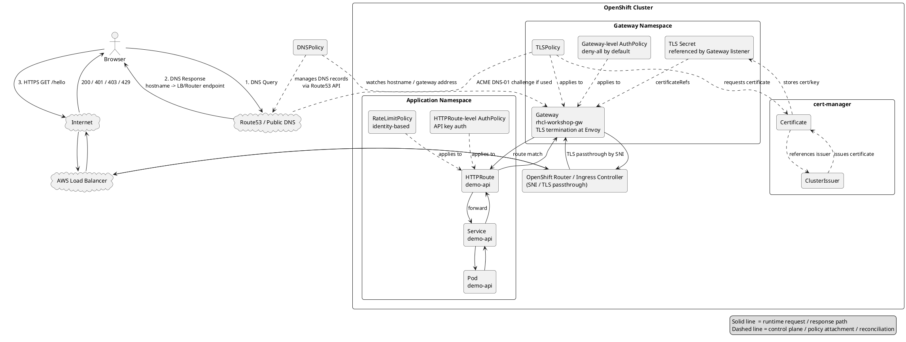

# RHCL デモ用ネットワーク経路図レビュー

## 目的

このドキュメントは、Red Hat Connectivity Link / Kuadrant / Gateway API を使ったデモ環境のネットワーク経路図について、Claude Code に修正・改善を依頼するためのレビュー指摘事項をまとめたものです。

対象の図は、以下のような処理の流れを PlantUML で表現したものです。

- DNS 解決
- TLS 終端
- API Key 認証
- Rate Limit
- HTTPRoute によるバックエンド転送
- 200 / 401 / 403 / 429 のレスポンス分岐

---

## 総評

全体として、以下の大枠は妥当です。

```text
Browser
  -> DNS resolution
  -> Internet
  -> AWS / OpenShift external entry point
  -> OpenShift Router / Ingress Controller
  -> Gateway
  -> HTTPRoute
  -> Service
  -> Pod
```

また、以下の構成要素を図に含めている点も良いです。

- DNSPolicy により Route53 側の DNS レコードを管理する
- TLSPolicy により TLS 証明書取得・更新を扱う
- Gateway に対して Gateway レベルの AuthPolicy / TLSPolicy を付ける
- HTTPRoute に対して API Key 認証用 AuthPolicy を付ける
- HTTPRoute に対して RateLimitPolicy を付ける
- 最終的に Service / Pod へ forward される
- 401 / 403 / 429 / 200 の結果を分けて表現している

ただし、現状の図は **Data Plane の通信経路** と **Control Plane の制御・reconcile 経路** が一部混ざって見えます。

そのため、Claude Code で図を修正する際は、以下の方針で整理するとよいです。

```text
実線: 実際のリクエスト通信経路
点線: policy / controller / reconcile / 管理 API の制御経路
```

---

## 修正優先度の高いポイント

## 1. DNS Query と DNSPolicy による Route53 管理を分ける

### 現状の懸念

図では、ブラウザからの DNS Query が Route53 / DNSPolicy 付近に向かうように見えます。

しかし、実際にはブラウザは DNSPolicy に問い合わせません。

DNSPolicy は Kubernetes 上の policy リソースであり、RHCL / Kuadrant 側の controller が Route53 などの DNS provider API を使って DNS レコードを管理するためのものです。

### 正しい整理

実行時の DNS 解決は以下です。

```text
Browser
  -> DNS query
  -> Public DNS / Route53 authoritative DNS
  -> DNS response
  -> Gateway hostname resolves to OpenShift Router / AWS Load Balancer endpoint
```

一方、DNSPolicy による DNS レコード管理は以下です。

```text
DNSPolicy
  -> controller reconcile
  -> Route53 API
  -> creates / updates DNS records
```

### Claude Code への修正指示

- Browser からの DNS Query は Route53 / Public DNS に向ける
- Browser から DNSPolicy へ向かうような線は描かない
- DNSPolicy から Route53 への線は `管理`, `reconcile`, `Route53 API`, `DNS record management` などのラベルを付ける
- DNSPolicy の線は通信経路ではなく Control Plane なので点線にする

### 図中コメント例

```text
DNSPolicy manages DNS records via Route53 API.
Browser does not query DNSPolicy directly.
```

---

## 2. TLS 終端位置を明確にする

### 現状の懸念

図には `TLS Passthrough` と記載されています。

この構成では、OpenShift Router は TLS を終端せず、SNI passthrough で Gateway 側へ流し、Gateway / Envoy 側で TLS を終端する想定だと思われます。

この考え方自体は妥当です。

ただし、図だけを見ると、TLS が Router で終端されるのか、Gateway で終端されるのかがやや曖昧です。

### 正しい整理

```text
Browser
  -> HTTPS request
  -> AWS Load Balancer
  -> OpenShift Router / Ingress Controller
       - TLS passthrough by SNI
  -> Gateway / Envoy
       - TLS termination
```

### Claude Code への修正指示

- Router 付近には `SNI passthrough` または `TLS passthrough` と明記する
- Gateway 付近には `TLS termination at Gateway / Envoy` と明記する
- TLSPolicy から生成・管理される証明書 Secret が Gateway listener の `certificateRefs` で参照される関係を描く

### 図中コメント例

```text
OpenShift Router performs SNI passthrough.
TLS is terminated at Gateway / Envoy.
```

---

## 3. OpenShift Router と AWS Load Balancer を分ける

### 現状の懸念

図では `Router (LoadBalancer)` のように表現されています。

デモ説明としては通じますが、厳密には Router 自体が LoadBalancer というより、OpenShift Router / Ingress Controller が AWS Load Balancer 経由で外部公開されます。

### 正しい整理

```text
Internet
  -> AWS Load Balancer
  -> OpenShift Router / Ingress Controller
  -> Gateway
```

### Claude Code への修正指示

- `Router (LoadBalancer)` という1つの箱ではなく、可能であれば以下の2つに分ける
  - `AWS Load Balancer`
  - `OpenShift Router / Ingress Controller`
- AWS Load Balancer は OpenShift Cluster の外側またはクラウド基盤側に置く
- OpenShift Router / Ingress Controller は OpenShift Cluster の中に置く

### 図中コメント例

```text
AWS Load Balancer exposes the OpenShift Router / Ingress Controller.
```

---

## 4. AuthPolicy / RateLimitPolicy は直接の通信経路ではなく policy 適用として描く

### 現状の懸念

図では、HTTPRoute の横に `AuthPolicy api-key` と `RateLimitPolicy identity-based` があり、リクエストがこれらの箱を直接通過するようにも見えます。

概念図としては問題ありませんが、厳密には AuthPolicy / RateLimitPolicy はリクエストが直接通過するコンポーネントではなく、Gateway / Envoy / Kuadrant 関連コンポーネントに適用される設定リソースです。

### 正しい整理

```text
HTTP request
  -> Gateway / Envoy
       -> auth check based on AuthPolicy
       -> rate-limit check based on RateLimitPolicy
       -> route to backend based on HTTPRoute
```

### Claude Code への修正指示

- AuthPolicy / RateLimitPolicy は HTTPRoute または Gateway に `applies to` する policy として点線で接続する
- 実線の通信経路は Browser -> Gateway -> HTTPRoute -> Service -> Pod に寄せる
- policy の箱をデータパス上のプロキシのように配置しすぎない

### 図中コメント例

```text
Policies are attached to Gateway / HTTPRoute.
They configure runtime behavior of Gateway / Envoy.
```

---

## 5. Gateway レベル AuthPolicy と HTTPRoute レベル AuthPolicy の関係を注記する

### 現状の懸念

図では Gateway 側に `deny-all` の AuthPolicy、HTTPRoute 側に API Key 認証の AuthPolicy があります。

この構成はデモとして有用ですが、見る人によっては以下の疑問を持つ可能性があります。

```text
Gateway レベルで deny-all しているなら、HTTPRoute 側の API Key 認証まで到達しないのでは？
```

### 説明すべき考え方

```text
Gateway-level AuthPolicy:
  Default protection / deny by default

HTTPRoute-level AuthPolicy:
  Route-specific authentication / authorization rule
```

### Claude Code への修正指示

- Gateway-level AuthPolicy には `default deny` または `deny-all by default` と注記する
- HTTPRoute-level AuthPolicy には `route-specific API key auth` と注記する
- 両者の関係を `default policy` と `route-specific policy` として説明する

### 図中コメント例

```text
Gateway-level AuthPolicy provides default protection.
HTTPRoute-level AuthPolicy defines route-specific API key authentication.
```

---

## 6. API Key 認証における 401 / 403 の説明を整理する

### 現状の懸念

図では Invalid API Key の結果として `401/403` のようにまとめて記載されています。

これはデモ実装や AuthPolicy の設定によって変わる可能性がありますが、説明としては 401 と 403 の意味を分けた方がよいです。

### 推奨する整理

```text
API Key なし / API Key 不正:
  -> 401 Unauthorized

認証は成功したが権限不足:
  -> 403 Forbidden

Rate limit 超過:
  -> 429 Too Many Requests

正常:
  -> 200 OK
```

### Claude Code への修正指示

- `Invalid -> 401/403` という表現を分解する
- 可能であれば以下のように注記する

```text
Missing or invalid API key -> usually 401
Authenticated but not allowed -> 403
Rate limit exceeded -> 429
```

---

## 7. cert-manager の Certificate / ClusterIssuer / Secret の関係を直す

### 現状の懸念

図では `Certificate -> ClusterIssuer` のように見える可能性があります。

cert-manager の概念としては、ClusterIssuer が Certificate を発行する、または Certificate が ClusterIssuer を参照して証明書を要求する、という関係です。

### 正しい整理

```text
TLSPolicy
  -> requests certificate
  -> cert-manager Certificate
  -> references ClusterIssuer
  -> obtains certificate from ACME / Let's Encrypt
  -> stores key pair in Kubernetes Secret
  -> Gateway listener references Secret via certificateRefs
```

### Claude Code への修正指示

- ClusterIssuer から Certificate へ発行する向き、または Certificate が ClusterIssuer を参照する向きにする
- Certificate の結果として TLS Secret が作られることを描く
- Gateway listener が TLS Secret を参照することを描く

### 図中コメント例

```text
Certificate references ClusterIssuer.
cert-manager stores the issued certificate in a Secret.
Gateway listener references the TLS Secret.
```

---

## 追加すると分かりやすい要素

## 8. Kuadrant / Authorino / Limitador の内部役割

### 補足

図が詳細説明向けであれば、以下の内部コンポーネントを注記として追加すると、AuthPolicy / RateLimitPolicy の実体が理解しやすくなります。

```text
Gateway / Envoy
  -> external auth check -> Authorino
  -> rate limit check -> Limitador
```

### Claude Code への修正指示

- 初学者向けの図であれば、Authorino / Limitador は省略してよい
- 技術者向けの詳細図であれば、右側の注釈または Gateway の近くに薄く追加する

### 図中コメント例

```text
AuthPolicy is enforced through Authorino.
RateLimitPolicy is enforced through Limitador.
```

---

## 9. Data Plane と Control Plane を明確に分ける

### 推奨方針

図全体を以下の2種類の線で整理すると、誤解が大きく減ります。

```text
実線:
  Runtime data path
  Browser -> LB -> Router -> Gateway -> Service -> Pod

点線:
  Control plane / reconciliation path
  DNSPolicy -> Route53
  TLSPolicy -> cert-manager -> Secret
  AuthPolicy / RateLimitPolicy -> Gateway / HTTPRoute
```

### Claude Code への修正指示

- 通信経路は実線に統一する
- policy 適用や controller による管理は点線に統一する
- 右下などに凡例を追加する

### 凡例例

```text
Legend:
  Solid line  = runtime request / response path
  Dashed line = control plane / policy attachment / reconciliation
```

---

## PlantUML 修正イメージ

以下は、既存 PlantUML を修正する際の概念的な構造です。既存の見た目を維持しつつ、この関係になるよう調整してください。



---

## 最終的な修正方針まとめ

Claude Code には、以下の優先順位で修正を依頼してください。

1. DNS Query と DNSPolicy による Route53 管理を分離する
2. TLS 終端が Gateway / Envoy 側であることを明記する
3. AWS Load Balancer と OpenShift Router / Ingress Controller を分ける
4. AuthPolicy / RateLimitPolicy は通信経路ではなく policy 適用として点線にする
5. Gateway レベル AuthPolicy と HTTPRoute レベル AuthPolicy の関係を注記する
6. 401 / 403 / 429 の意味を整理する
7. cert-manager の Certificate / ClusterIssuer / Secret の関係を修正する
8. 必要に応じて Authorino / Limitador を注記として追加する
9. 実線と点線の凡例を追加する

---

## 端的な指示文

Claude Code にそのまま渡す場合は、以下のように依頼するとよいです。

```text
この PlantUML 図は RHCL / Kuadrant / Gateway API のデモ経路図です。
大枠は妥当ですが、Data Plane と Control Plane が混ざって見えるため、以下の方針で修正してください。

- 実線は Runtime request / response path に限定してください。
- 点線は policy attachment / controller reconcile / DNS and TLS management に限定してください。
- Browser は DNSPolicy に問い合わせないため、DNS Query は Route53 / Public DNS に向けてください。
- DNSPolicy は Route53 API により DNS レコードを管理する Control Plane として描いてください。
- AWS Load Balancer と OpenShift Router / Ingress Controller は分けて描いてください。
- Router は SNI / TLS passthrough、Gateway / Envoy は TLS termination と明記してください。
- AuthPolicy / RateLimitPolicy は直接の通信経路ではなく、Gateway / HTTPRoute に適用される policy として点線で描いてください。
- Gateway-level AuthPolicy は default deny、HTTPRoute-level AuthPolicy は route-specific API key auth として関係が分かるようにしてください。
- 401 / 403 / 429 の意味を分けて注記してください。
- cert-manager は Certificate が ClusterIssuer を参照し、発行された証明書が Secret に保存され、Gateway listener の certificateRefs で参照される関係にしてください。
```
